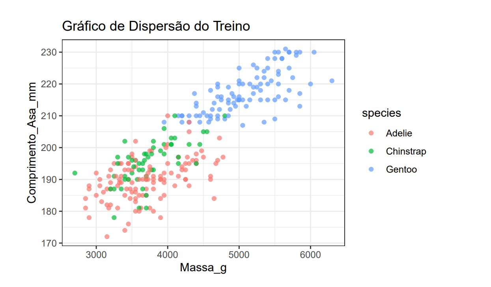

# Classificação Multiclasse de Espécies com Machine Learning

Este repositório contém um estudo comparativo de algoritmos de Machine Learning supervisionado para classificação de espécies de pinguins com base em medidas corporais. O projeto abrange desde a análise exploratória de dados (EDA) até a implementação manual de algoritmos e avaliação de complexidade computacional.

## Sobre o Projeto

O objetivo deste trabalho foi criar modelos preditivos capazes de identificar corretamente entre três espécies de pinguins (*Adelie*, *Chinstrap* e *Gentoo*) do arquipélago Palmer, na Antártica.

O diferencial deste projeto é a abordagem teórica: além de utilizar bibliotecas padrão do R, foi realizada a **implementação manual do algoritmo KNN** para demonstrar o entendimento matemático do cálculo de distâncias e da complexidade assintótica (Big O) envolvida no processamento de dados.

## Conteúdo do Repositório

* **[`relatorio_classificaçao.pdf`](relatorio_classificaçao.pdf)**: Relatório completo contendo a análise exploratória, códigos, gráficos e a discussão teórica sobre a performance dos modelos.
* **[`projeto2.qmd`](projeto2.qmd)**: Código-fonte completo em **Quarto**. Contém a implementação dos algoritmos, a análise exploratória (EDA) e a redação técnica misturada com blocos de código R executáveis.
  
## Metodologia e Modelos

O estudo seguiu o pipeline clássico de Ciência de Dados:

1.  **Limpeza e Tratamento**: Correção de tipos de dados (fatores) e verificação de valores nulos.
2.  **Análise Exploratória (EDA)**: Visualização de distribuições com histogramas e boxplots para identificar padrões de separabilidade entre as classes (ex: distinção clara da espécie *Gentoo* pela massa corporal).
3.  **Modelagem**:
    * **K-Nearest Neighbors (KNN)**: Implementação própria (`knn.amador`) e comparativo com a versão otimizada. Análise de performance em 2D, 3D e 4D.
    * **Random Forest**: Testes com 50, 100, 500 e 2000 árvores para avaliar a estabilidade da acurácia.
    * **Support Vector Machine (SVM)**: Comparação entre Kernels Radial (melhor performance), Linear e Polinomial.

## Resultados Principais

A análise comparativa revelou que a dimensão dos dados é crucial para a separabilidade das classes, especialmente entre *Adelie* e *Chinstrap*, que se sobrepõem em análises bidimensionais.

* **Melhor Desempenho**: O modelo KNN com 4 variáveis (dimensões) atingiu **100% de acurácia** nos testes realizados.
* **Random Forest**: Alcançou estabilidade e acurácia próxima a 98-100% com 500 árvores, superando árvores de decisão únicas que apresentaram alta variância.
* **SVM**: O Kernel Radial obteve 94% de acurácia, demonstrando ser superior aos kernels lineares para fronteiras de decisão complexas.

## Tecnologias Utilizadas

* **Linguagem R**
* **Bibliotecas**: `tidyverse` (manipulação e gráficos), `class` (KNN), `randomForest` e `e1071` (SVM).
* **Conceitos**: Classificação Supervisionada, Matriz de Confusão, Padronização de Dados ($scale$), Análise Assintótica (Big O).

## Visualização dos Dados

Exemplo de dispersão (Scatterplot) demonstrando a separabilidade das espécies baseada no comprimento do bico e massa corporal:

---

### Autor

**Matheus de Moraes**
* Universidade Federal de Uberlândia (UFU)
* [LinkedIn](https://www.linkedin.com/in/matheus-neves-864aa01a8/)
